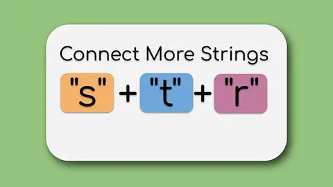
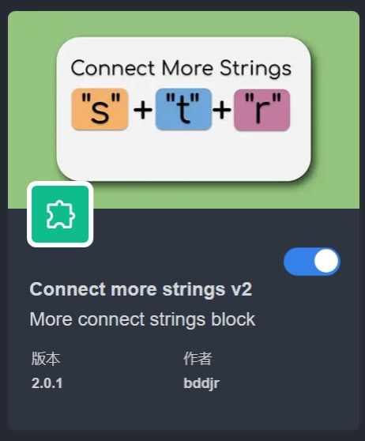

# Connect more strings v2

> Icon copy from <https://github.com/bddjr/clipcc-extension-connect_more_strings/pull/1>

你可以从 Releases 下载它。

You can download it from Releases.

## 打包方法：
<https://github.com/bddjr/clipcc-extension_simple_template>  

***
## Pictures

