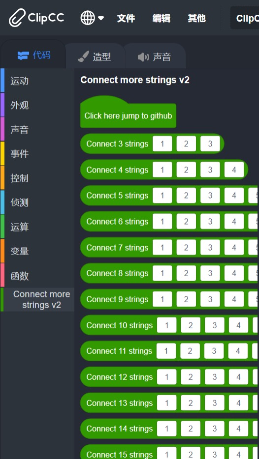

# Connect more strings v2

> Icon copy from <https://github.com/bddjr/clipcc-extension-connect_more_strings/pull/1>

***

你可以从 Releases 下载它。

You can download it from Releases.

***

## 打包方法：
将 code 文件夹压缩为 zip 文件，然后运行 rename.bat 。  
如果你已安装 bandizip ，可以使用 pakaging.bat 。

## Packaging method: 
Compress the code folder into a zip file, and then run rename.bat .  
If you have installed bandizip, you can use pakaging.bat .

***
## Pictures

